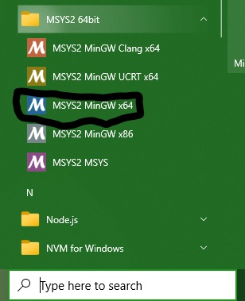

# BinaryTreeTraversal-CG
Visualization of binary tree traversal through OpenGL

### How to run:
- ### On Windows:
    - Install VS Code
    - Install [Make](https://sourceforge.net/projects/gnuwin32/files/make/3.81/make-3.81-src.zip/download?use_mirror=excellmedia&download=)
    - Add Make's file path to your system variable's PATH
    - Download and Install [MSYS2](https://github.com/msys2/msys2-installer/releases/download/2023-05-26/msys2-x86_64-20230526.exe) _([Installation procedure](https://www.msys2.org/))_

    - 
    - Type the following command in the terminal. 
        **<code> pacman -S mingw-w64-x86_64-freeglut </code>**
    - Paste this path in windows system variables.
        **<code>C:\msys64\mingw64\include\GL</code>** 
    - Paste the files in the ./InstallationHelp ending with .lib extension in the following path. 
        **<code>C:\msys64\mingw64\lib</code>**

    - Open VS Code in the desired location.
    - Type the following command in the VS Code's terminal. 
        **<code>git clone https<nolink>://github.com/Ghanashyama-K-P-Makkithaya/BinaryTreeOperation-CG.git</code>**
    - Make sure you are in the destination folder and run the following command in the same terminal. 
        **<code>make all</code>**